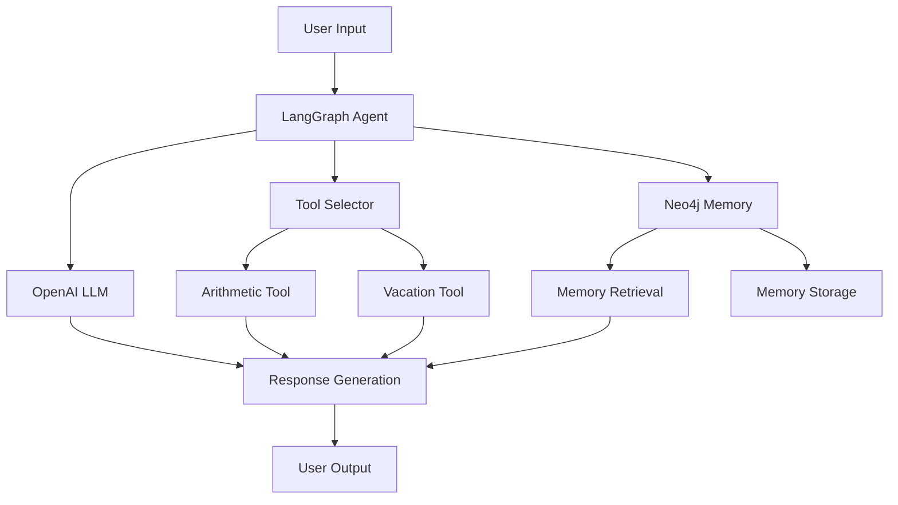

# LangGraph Agent Documentation

A powerful Python-based conversational AI agent built with LangGraph, featuring advanced memory capabilities and tool integration.

## Table of Contents

- [Overview](#overview)
- [Features](#features)
- [Architecture](#architecture)
- [Prerequisites](#prerequisites)
- [Installation](#installation)
- [Configuration](#configuration)
- [Usage](#usage)
- [Project Structure](#project-structure)
- [Core Components](#core-components)
- [Memory System](#memory-system)
- [Tools](#tools)
- [How It Works](#how-it-works)
- [Deployment](#deployment)
- [Contributing](#contributing)
- [Troubleshooting](#troubleshooting)
- [License](#license)

## Overview

The LangGraph Agent is an intelligent conversational AI system that combines the power of LangChain and LangGraph with advanced memory capabilities using Neo4j graph database. This agent can engage in complex conversations, remember context across interactions, and utilize various tools to provide comprehensive assistance.

### Key Highlights

- **Graph-based Memory**: Utilizes Neo4j for sophisticated memory storage and retrieval
- **Tool Integration**: Includes arithmetic and vacation planning tools
- **Conversational Flow**: Built on LangGraph for structured conversation management
- **OpenAI Integration**: Powered by OpenAI's language models
- **Extensible Architecture**: Easy to add new tools and capabilities

## Features

- 🧠 **Advanced Memory System**: Graph-based memory using Neo4j for context retention
- 🔧 **Built-in Tools**: Arithmetic calculations and vacation planning assistance  
- 💬 **Natural Conversations**: Smooth conversational flow with context awareness
- 🔄 **State Management**: Sophisticated state management using LangGraph
- 📊 **Memory Visualization**: Query and visualize conversation memories
- 🚀 **Easy Integration**: Simple setup and deployment process

## Architecture

The system follows a modular architecture with clear separation of concerns:



## Prerequisites

- Python 3.8+
- Neo4j Database
- OpenAI API Key
- Required Python packages (see requirements.txt)

## Installation

### 1. Clone the Repository

```bash
git clone https://github.com/vedantparmar12/langgraph-agent.git
cd langgraph-agent
```

### 2. Set Up Virtual Environment

```bash
python -m venv venv
source venv/bin/activate  # On Windows: venv\Scripts\activate
```

### 3. Install Dependencies

```bash
pip install -r requirements.txt
```

### 4. Set Up Neo4j Database

Install and start Neo4j database locally or use a cloud instance.

### 5. Configure Environment Variables

Create a `.env` file in the project root:

```env
OPENAI_API_KEY=your_openai_api_key_here
NEO4J_URI=bolt://localhost:7687
NEO4J_USERNAME=neo4j
NEO4J_PASSWORD=your_neo4j_password
LANGSMITH_API_KEY=your_langsmith_key (optional)
```

## Configuration

The application uses environment variables for configuration. Key settings include:

- **OPENAI_API_KEY**: Your OpenAI API key for LLM access
- **NEO4J_URI**: Neo4j database connection URI
- **NEO4J_USERNAME/PASSWORD**: Neo4j database credentials
- **LANGSMITH_API_KEY**: Optional LangSmith integration for monitoring

## Usage

### Basic Usage

```bash
python main.py
```

This starts the interactive agent that you can chat with directly.

### Programmatic Usage

```python
from agent import create_agent

# Initialize the agent
agent = create_agent()

# Run a query
response = agent.invoke({
    "messages": [{"role": "user", "content": "What's 25 + 17?"}]
})

print(response)
```

### Example Interactions

1. **Arithmetic Operations**:
   ```
   User: What's 15 * 23?
   Agent: I'll calculate that for you. 15 × 23 = 345
   ```

2. **Vacation Planning**:
   ```
   User: Plan a vacation to Paris
   Agent: I'd be happy to help you plan a vacation to Paris! Let me gather some information...
   ```

3. **Memory Queries**:
   ```
   User: What did we discuss about my trip plans?
   Agent: Based on our previous conversations, you mentioned interest in planning a trip to Paris...
   ```

## Project Structure

```
langgraph-agent/
├── agent.py              # Main agent implementation
├── main.py               # Entry point and CLI interface
├── requirements.txt      # Python dependencies
├── pyproject.toml       # Project configuration
├── README.md            # Project documentation
├── memory/              # Memory system components
│   ├── __init__.py
│   └── neo4j_memory.py  # Neo4j memory implementation
└── tools/               # Agent tools
    ├── __init__.py
    ├── arithmetic_tool.py # Arithmetic calculations
    └── vacation_tool.py   # Vacation planning tool
```

## Core Components

### 1. Agent (agent.py)

The main agent implementation that orchestrates the conversation flow:

- **Graph Construction**: Uses LangGraph to create the conversation flow
- **State Management**: Manages conversation state and context
- **Tool Integration**: Coordinates between different tools
- **Memory Integration**: Interfaces with the memory system

### 2. Memory System (memory/neo4j_memory.py)

Graph-based memory system using Neo4j:

- **Context Storage**: Stores conversation context as graph nodes
- **Relationship Mapping**: Creates relationships between entities
- **Memory Retrieval**: Intelligent memory search and retrieval
- **Memory Management**: Handles memory cleanup and optimization

### 3. Tools

#### Arithmetic Tool (tools/arithmetic_tool.py)
- Performs mathematical calculations
- Supports basic operations (+, -, *, /)
- Returns formatted results

#### Vacation Tool (tools/vacation_tool.py)
- Assists with vacation planning
- Provides destination information
- Helps with itinerary creation

## Memory System

The Neo4j-based memory system provides sophisticated context management:

### Memory Storage
- Conversations stored as connected nodes
- Entities and relationships extracted automatically
- Temporal connections maintained

### Memory Retrieval
- Context-aware memory search
- Relevant information retrieval based on current conversation
- Memory consolidation for long-term storage

### Memory Queries
```python
# Example memory operations
memory.store_conversation(user_id, message, response)
relevant_memories = memory.retrieve_context(query, limit=5)
memory.update_entity_relationship(entity1, entity2, relationship)
```

## How It Works

1. **Input Processing**: User input is received and processed
2. **Memory Retrieval**: Relevant memories are retrieved from Neo4j
3. **Context Building**: Current context is built with retrieved memories
4. **Tool Selection**: Agent determines if tools are needed
5. **Response Generation**: LLM generates response with available context
6. **Memory Update**: New information is stored in the memory system
7. **Output Delivery**: Response is delivered to the user

## Deployment

### Local Deployment

1. Ensure Neo4j is running
2. Set environment variables
3. Run `python main.py`

### Docker Deployment

```dockerfile
FROM python:3.9-slim

WORKDIR /app
COPY . .
RUN pip install -r requirements.txt

CMD ["python", "main.py"]
```

### Cloud Deployment

The application can be deployed to various cloud platforms:
- **AWS**: Using EC2 with Neo4j AuraDB
- **Google Cloud**: Using Compute Engine with Neo4j
- **Azure**: Using Virtual Machines with Neo4j

## Dependencies

### Core Dependencies
- `langgraph`: Graph-based conversation flow
- `langchain`: LLM orchestration framework
- `langchain-openai`: OpenAI integration
- `neo4j`: Neo4j database driver
- `openai`: OpenAI API client
- `pydantic`: Data validation
- `python-dotenv`: Environment variable management

### Optional Dependencies
- `langsmith`: LangChain monitoring and debugging
- `orjson`: Fast JSON serialization
- `requests`: HTTP client library

## Contributing

1. Fork the repository
2. Create a feature branch (`git checkout -b feature/new-feature`)
3. Make your changes
4. Add tests if applicable
5. Commit your changes (`git commit -am 'Add new feature'`)
6. Push to the branch (`git push origin feature/new-feature`)
7. Create a Pull Request

### Development Guidelines

- Follow PEP 8 style guidelines
- Add docstrings to all functions and classes
- Include unit tests for new features
- Update documentation as needed

## Troubleshooting

### Common Issues

1. **Neo4j Connection Error**
   - Verify Neo4j is running
   - Check connection credentials
   - Ensure correct URI format

2. **OpenAI API Errors**
   - Verify API key is set correctly
   - Check API quota and billing
   - Ensure proper rate limiting

3. **Memory Issues**
   - Check Neo4j disk space
   - Verify database permissions
   - Review memory cleanup procedures

### Debug Mode

Enable debug logging by setting:
```python
import logging
logging.basicConfig(level=logging.DEBUG)
```

## Performance Considerations

- **Memory Usage**: Monitor Neo4j memory consumption
- **API Costs**: Track OpenAI API usage
- **Response Time**: Optimize memory queries for faster responses
- **Scalability**: Consider connection pooling for high-load scenarios

## Security Notes

- Store API keys securely using environment variables
- Use proper authentication for Neo4j database
- Implement input validation for user queries
- Regular security updates for dependencies

## Future Enhancements

- Multi-user support with user-specific memories
- Additional tool integrations
- Voice interface capabilities
- Advanced memory visualization
- Real-time collaboration features

## License

This project is licensed under the MIT License - see the LICENSE file for details.

## Support

For support and questions:
- Create an issue on GitHub
- Check the troubleshooting section
- Review the documentation

---

*Built with ❤️ using LangGraph, LangChain, and Neo4j*
